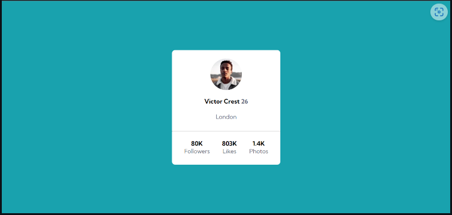
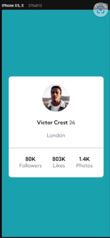
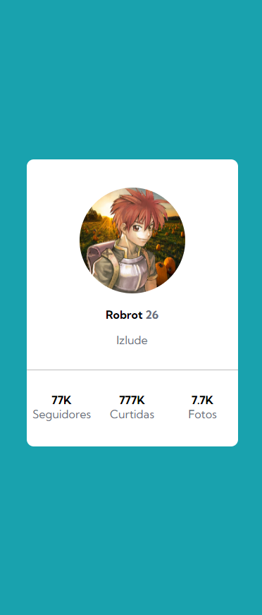

# Desafio Profile Card
- Desafio do DevQuest de HTML + CSS avançados.

A ideia era usar os conhecimentos adquiridos para reproduzir uma página apenas olhando a imagem dela.

### Os exemplos usados:

### Resultado:

