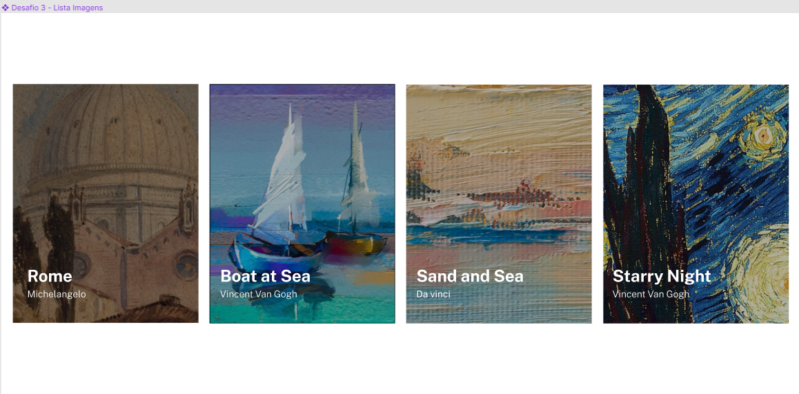
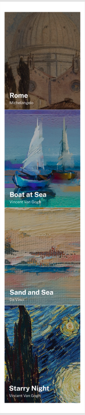

# Desafio 4 - Lista de Imagens estilizada com Flex

Consegui rapidamente resolver esse desafio. Senti que estou evoluindo bem no CSS, esse exercício eu fiz totalmente de cabeça.

A prática levando à perfeição ✨

## Exemplo usado do Figma

</img>
</img>