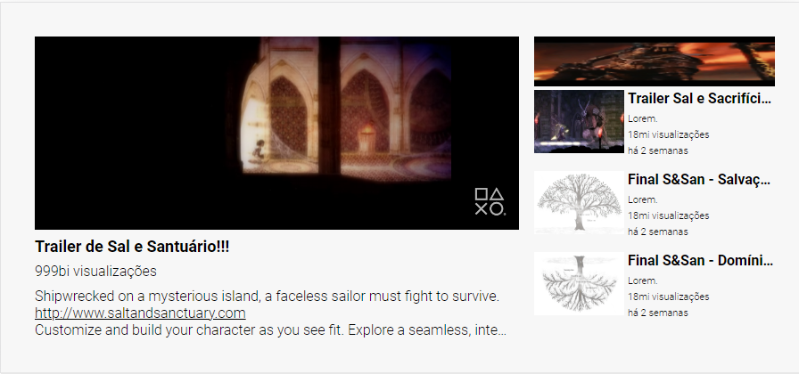

# Desafio 5 - Layout YouTube com Grid

Desafio que eu mais gostei até agora. Me desafiou muito com o uso de grid e flex.

Mas consegui fazer relativamente rápido o que me deixou bem feliz, mostrando que minhas habilidades estão realmente sendo aprimoradas! 😀

## Exemplo usado do Figma

</img>

## Resultado Final

</img>